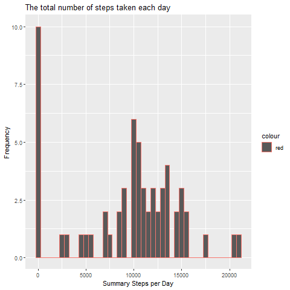
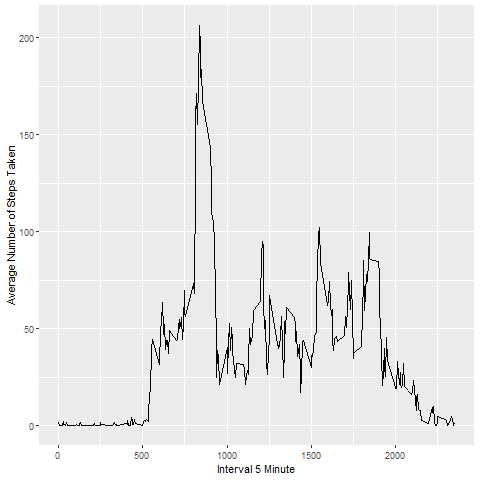
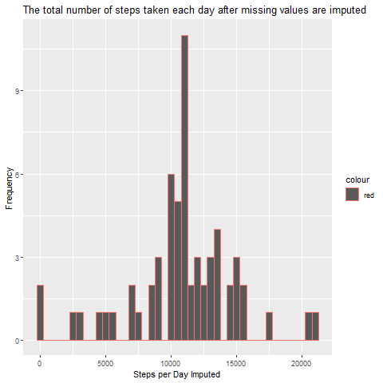
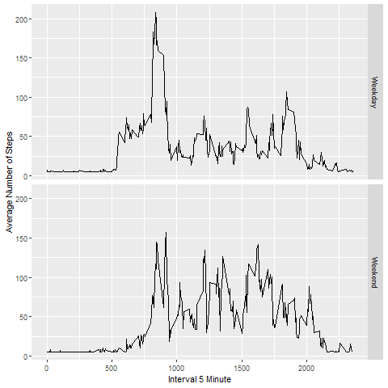

## Reproducible Research

## Library

```r
library(dplyr)
library(ggplot2)
library(scales)
library(Hmisc)
```


##### 01. Code for reading in the dataset and/or processing the data
```r
data_activity<-read.csv("activity.csv")

data_activity$date<-as.Date(as.character(data_activity$date))
```


## group step by date
```r
data_step <- tapply(data_activity$steps, data_activity$date, sum, na.rm=TRUE)
```

##### 02. Histogram of the total number of steps taken each day
```r
png("1.Histogram.png", width=480, height=480)

qplot(data_step, xlab='Summary Steps per Day', ylab='Frequency', binwidth=500,main="The total number of steps taken each day",col="red")

dev.off()
```




##### 03. group step by date mean & median
```r
data_step_mean <- mean(data_step)

data_step_median <- median(data_step)
```
* Mean: 9,354
* Median:  10,395


##### 04. Time series plot of the average number of steps taken
```r
avgstep <- aggregate(x=list(meanSteps=data_activity$steps), by=list(interval=data_activity$interval), FUN=mean, na.rm=TRUE)

png("2.Interval.png", width=480, height=480)

ggplot(data=avgstep, aes(x=interval, y=meanSteps)) + geom_line() + xlab("Interval 5 Minute") + ylab("Average Number of Steps Taken")

dev.off()
```



##### 05. The 5-minute interval that, on average, contains the maximum number of steps
```r
numstep <- which.max(avgstep$meanSteps)

timestep <-  gsub("([0-9]{1,2})([0-9]{2})", "\\1:\\2", avgstep[numstep,'interval'])
```
* timestep at: 8:35


##### 06. Code to describe and show a strategy for imputing missing data
```r
missval <- length(which(is.na(data_activity$steps)))
```
* missing values: 2,304

```r
dat_imp <- data_activity

dat_imp$steps <- impute(data_activity$steps, fun=mean)
```


##### 07. Histogram of the total number of steps taken each day after missing values are imputed
```r
stepimp <- tapply(dat_imp$steps, dat_imp$date, sum)

png("3.Histogram imputed.png", width=480, height=480)

qplot(stepimp, xlab='Steps per Day Imputed', ylab='Frequency', binwidth=500,main="The total number of steps taken each day after missing values are imputed",col="red")

dev.off()
```



#### 08. Panel plot comparing the average number of steps taken per 5-minute interval across weekdays and weekends
```r
dat_imp$dateType <-  ifelse(as.POSIXlt(dat_imp$date)$wday %in% c(0,6), 'Weekend', 'Weekday')

png("4.Interval imputed.png", width=480, height=480)

avg_dat_imp <- aggregate(steps ~ interval + dateType, data=dat_imp, mean)

ggplot(avg_dat_imp, aes(interval, steps)) + geom_line() + facet_grid(dateType ~ .) + xlab("Interval 5 Minute") + ylab("Average Number of Steps")

dev.off()
```


## Mochamad Gilang Saputra
